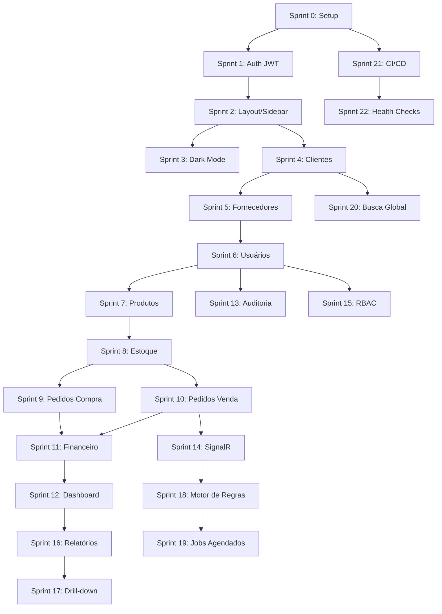

# SDD — Micro ERP (.NET 10 + React)

## 1. Visão Geral

**Objetivo:** construir um micro ERP full stack como projeto de portfólio, demonstrando modelagem de domínio complexa, autenticação/autorização real, boas práticas de arquitetura e maturidade de engenharia (CI/CD, observabilidade, processamento assíncrono).

**Módulos de negócio:** Clientes, Fornecedores, Usuários, Produtos, Estoque, Pedidos de Compra, Pedidos de Venda, Financeiro (Contas a Pagar/Receber).

**Módulos de plataforma:** Autenticação (JWT), Autorização (RBAC), Dashboard, Auditoria/Logs, Notificações (SignalR), Relatórios, Motor de Regras/Alertas, Jobs agendados, Busca global, Health checks.

## 2. Stack Tecnológica

| Camada | Tecnologia |
|---|---|
| Backend | .NET 10, ASP.NET Core Web API, Entity Framework Core, SQL Server |
| Autenticação | JWT Bearer Token |
| Real-time | SignalR |
| Jobs assíncronos | Hangfire (ou Quartz.NET) |
| Frontend | React + TypeScript |
| UI Library | PrimeReact (free) |
| Gráficos | Recharts ou Chart.js |
| Relatórios | QuestPDF (PDF) + ClosedXML ou CSV nativo (Excel/.csv) |
| Busca | Full-text search do SQL Server (evolução futura: Elasticsearch) |
| Infra | Docker + Docker Compose |
| CI/CD | GitHub Actions |

## 3. Arquitetura Geral

- Backend em Clean Architecture (Domain / Application / Infrastructure / API).
- Frontend organizado por features (cada módulo com seus componentes, hooks, services).
- Autenticação stateless via JWT; payload do token carrega `userId`, `roles`.
- Autorização via `[Authorize(Roles = "...")]` no backend + guarda de rotas no frontend.
- Toda ação de escrita (criar/editar/excluir) gera registro de auditoria.

---

## 4. Roadmap de Sprints

> Cada sprint é pensada para gerar uma entrega demonstrável (algo que roda e pode ser mostrado), não apenas código morto. Estimativas assumem dedicação de estudo/hobby (não full-time).

### Sprint 0 — Setup do Projeto
**Objetivo:** preparar o esqueleto do repositório antes de qualquer feature.
- Criar solution .NET 10 (API, Domain, Application, Infrastructure, Tests)
- Criar projeto React + TypeScript (Vite)
- Configurar Docker Compose (API + SQL Server + frontend)
- Configurar EF Core com SQL Server, migrations iniciais
- Estrutura de pastas por feature no frontend
- README inicial com instruções de execução
**Critério de aceite:** `docker compose up` sobe API + banco + frontend, todos respondendo.
**Estimativa:** 3-5 dias

---

### Sprint 1 — Autenticação com JWT
**Objetivo:** login funcional com usuário/senha fictícios.
- Entidade `Usuario` (com hash de senha — BCrypt)
- Seed de usuário fake para testes (ex: `admin@erp.com` / `Admin123!`)
- Endpoint `POST /api/auth/login` retornando JWT
- Middleware de validação de token
- Tela de Login no React (PrimeReact `InputText` + `Password`)
- Armazenamento do token (contexto React + cookie httpOnly ou memória)
- Rota protegida (redirect para login se não autenticado)
**Critério de aceite:** login com usuário seed autentica e redireciona para área logada; token expira e força novo login.
**Estimativa:** 4-6 dias

---

### Sprint 2 — Layout Base e Sidebar
**Objetivo:** esqueleto visual da aplicação logada.
- Sidebar esquerda com os menus (ainda sem funcionalidade real, só navegação)
- Roteamento com React Router, rotas protegidas por autenticação
- Layout responsivo (colapsar sidebar em telas menores)
- Header com nome do usuário logado + botão de logout
**Critério de aceite:** navegação entre todas as páginas (mesmo vazias) via sidebar funcionando.
**Estimativa:** 3-4 dias

---

### Sprint 3 — Tema / Dark Mode
**Objetivo:** alternância de tema clara/escura.
- Configuração de tema do PrimeReact
- Toggle no header ou em tela de configurações
- Persistência da preferência (localStorage)
**Critério de aceite:** troca de tema instantânea, preferência mantida após reload.
**Estimativa:** 1-2 dias

---

### Sprint 4 — CRUD de Clientes
**Objetivo:** primeiro módulo de cadastro completo (padrão a ser replicado nos demais).
- Entidade `Cliente` (dados cadastrais, contato, endereço)
- Endpoints REST (GET, POST, PUT, DELETE) com paginação e filtro
- Tela de listagem (DataTable do PrimeReact) com busca/paginação
- Formulário de criação/edição (modal ou página)
- Validações de formulário (frontend) e de domínio (backend)
**Critério de aceite:** CRUD completo de Clientes funcionando ponta a ponta.
**Estimativa:** 4-5 dias

---

### Sprint 5 — CRUD de Fornecedores
**Objetivo:** replicar o padrão do Sprint 4 para Fornecedores.
- Entidade `Fornecedor`
- Endpoints + tela seguindo o mesmo padrão de Clientes
**Critério de aceite:** CRUD completo de Fornecedores.
**Estimativa:** 2-3 dias (reaproveitando padrão)

---

### Sprint 6 — CRUD de Usuários Internos
**Objetivo:** gestão dos usuários do sistema (base para o RBAC futuro).
- Entidade `Usuario` expandida (nome, e-mail, status ativo/inativo)
- Associação usuário → papéis (estrutura pronta, tela de atribuição vem no Sprint 15)
- Endpoints + tela de CRUD
**Critério de aceite:** administrador consegue criar/editar/inativar usuários internos.
**Estimativa:** 3-4 dias

---

### Sprint 7 — CRUD de Produtos
**Objetivo:** cadastro de produtos, base para Estoque e Pedidos.
- Entidade `Produto` (SKU, descrição, preço, unidade, categoria)
- Endpoints + tela de CRUD
**Critério de aceite:** CRUD completo de Produtos.
**Estimativa:** 3-4 dias

---

### Sprint 8 — Estoque / Inventário
**Objetivo:** módulo com lógica de negócio real (o mais valioso para portfolio até aqui).
- Entidade `MovimentacaoEstoque` (entrada, saída, ajuste)
- Regra de negócio: impedir saldo negativo
- Cálculo de saldo atual por produto
- Histórico de movimentações por produto
- Tela de movimentação + tela de consulta de saldo/histórico
**Critério de aceite:** movimentações refletem corretamente no saldo; tentativa de saída maior que o saldo é bloqueada.
**Estimativa:** 5-7 dias

---

### Sprint 9 — Pedidos de Compra
**Objetivo:** primeiro fluxo de relacionamento complexo (pedido → itens → produto → estoque).
- Entidade `PedidoCompra` + `ItemPedidoCompra`
- Vínculo com Fornecedor
- Ao confirmar recebimento, gera movimentação de entrada no estoque
- Tela de criação de pedido (seleção de fornecedor + itens dinâmicos)
- Tela de listagem/status do pedido (pendente, recebido, cancelado)
**Critério de aceite:** confirmar recebimento de um pedido de compra aumenta o saldo dos produtos envolvidos.
**Estimativa:** 6-8 dias

---

### Sprint 10 — Pedidos de Venda
**Objetivo:** espelhar o Sprint 9 para o fluxo de saída.
- Entidade `PedidoVenda` + `ItemPedidoVenda`
- Vínculo com Cliente
- Ao confirmar venda, gera movimentação de saída no estoque (respeitando saldo)
- Tela de criação/listagem análoga à de Compras
**Critério de aceite:** confirmar uma venda reduz o saldo; venda maior que o saldo disponível é bloqueada.
**Estimativa:** 5-7 dias

---

### Sprint 11 — Financeiro (Contas a Pagar/Receber)
**Objetivo:** módulo financeiro nascendo naturalmente dos pedidos.
- Entidade `ContaFinanceira` (tipo: pagar/receber, status: pendente/pago/vencido)
- Pedido de Compra confirmado gera Conta a Pagar
- Pedido de Venda confirmado gera Conta a Receber
- Tela de listagem com filtro por status e vencimento
- Dashboard simples de fluxo de caixa (entradas x saídas por período)
**Critério de aceite:** contas são geradas automaticamente a partir dos pedidos; baixa manual de pagamento/recebimento funciona.
**Estimativa:** 5-6 dias

---

### Sprint 12 — Dashboard com Gráficos
**Objetivo:** tela inicial com agregação de dados (não apenas CRUD).
- Gráfico de vendas do mês (Recharts/Chart.js)
- Gráfico de produtos mais vendidos
- Lista/gráfico de contas a vencer nos próximos dias
- Endpoints de agregação otimizados (evitar N+1, usar queries agregadas)
**Critério de aceite:** dashboard carrega dados reais dos módulos já implementados, com gráficos interativos.
**Estimativa:** 4-5 dias

---

### Sprint 13 — Auditoria / Logs
**Objetivo:** rastreabilidade de alterações (alinhado com o que já é feito no SWnet).
- Interceptor/middleware do EF Core para capturar criação/edição/exclusão
- Entidade `LogAuditoria` (usuário, entidade, ação, dados antes/depois, timestamp)
- Tela de consulta de auditoria com filtros (usuário, entidade, período)
**Critério de aceite:** qualquer alteração em Clientes, Produtos, Pedidos etc. gera registro consultável de auditoria.
**Estimativa:** 4-5 dias

---

### Sprint 14 — Notificações em Tempo Real (SignalR)
**Objetivo:** demonstração ao vivo de WebSockets funcionando.
- Hub SignalR no backend
- Eventos: "novo pedido de venda", "estoque crítico" (abaixo de um limite)
- Componente de notificações no frontend (toast + painel/badge dinâmico)
- Conexão autenticada via JWT no hub
**Critério de aceite:** criar um pedido de venda em uma aba dispara notificação instantânea em outra aba logada.
**Estimativa:** 4-6 dias

---

### Sprint 15 — RBAC (Tela de Permissões)
**Objetivo:** controle de acesso baseado em papéis, configurável via UI.
- Entidades `Papel` (Role) e `Permissao`, associação N:N com Usuário
- Tela de Configurações → gestão de papéis e permissões por módulo/ação
- Middleware de autorização revisado para checar permissões dinâmicas (não só roles fixas no código)
- Menus da sidebar renderizados conforme permissões do usuário logado
**Critério de aceite:** criar um papel com acesso restrito (ex: só leitura em Financeiro) e validar que um usuário com esse papel não consegue editar.
**Estimativa:** 6-8 dias

---

### Sprint 16 — Relatórios (Exportação PDF/Excel)
**Objetivo:** diferencial técnico de geração/streaming de arquivos no backend.
- Relatório de Vendas por período (tela + exportação)
- Geração de PDF no backend (QuestPDF) via streaming
- Exportação para Excel/.csv
**Critério de aceite:** usuário exporta relatório de vendas em PDF e em CSV, ambos com os dados corretos.
**Estimativa:** 4-5 dias

---

### Sprint 17 — Relatórios com Drill-down
**Objetivo:** evoluir relatórios estáticos para interativos.
- Gráfico "Vendas por região" clicável
- Ao clicar, navega para detalhamento "Vendas por cliente daquela região"
- Reaproveitar componentes de gráfico do Dashboard (Sprint 12)
**Critério de aceite:** clique no gráfico agregado abre a visão detalhada correspondente.
**Estimativa:** 3-4 dias

---

### Sprint 18 — Motor de Regras / Alertas Configuráveis
**Objetivo:** diferencial de arquitetura — regras definidas pelo usuário, não fixas no código.
- Entidade `RegraAlerta` (condição, tipo de métrica, limite, ação)
- Motor simples de avaliação de regras (ex: "se saldo do produto X < N, notificar")
- Tela de configuração de regras
- Integração com o módulo de Notificações (Sprint 14)
**Critério de aceite:** usuário cria uma regra customizada ("avise quando estoque de Produto Y < 10") e recebe notificação quando a condição é atingida.
**Estimativa:** 6-8 dias

---

### Sprint 19 — Jobs Agendados / Background Tasks
**Objetivo:** demonstrar processamento assíncrono no .NET.
- Configurar Hangfire (dashboard incluso, ótimo para demo)
- Job recorrente: fechamento mensal (consolidação de dados)
- Job recorrente: envio de relatório automático por e-mail
- Job de varredura das Regras de Alerta (Sprint 18) em background
**Critério de aceite:** dashboard do Hangfire mostra jobs executando conforme agendamento; e-mail de relatório é enviado automaticamente.
**Estimativa:** 4-6 dias

---

### Sprint 20 — Busca Global (Ctrl+K)
**Objetivo:** UX diferenciada + indexação/full-text search.
- Atalho de teclado Ctrl+K abrindo modal de busca
- Endpoint único de busca consultando Clientes, Produtos e Pedidos (full-text search do SQL Server)
- Resultados categorizados com navegação direta ao registro
**Critério de aceite:** busca por um termo retorna resultados combinados dos três módulos em menos de 1s.
**Estimativa:** 3-5 dias

---

### Sprint 21 — CI/CD (GitHub Actions)
**Objetivo:** maturidade de entrega — frequentemente decisivo para recrutadores.
- Pipeline: build + testes automatizados (backend e frontend) a cada push
- Build e push de imagens Docker
- Deploy automático (ambiente de homologação, ex: Azure App Service, Render ou similar)
**Critério de aceite:** push na branch principal dispara pipeline completo até deploy, sem intervenção manual.
**Estimativa:** 4-6 dias

---

### Sprint 22 — Health Checks + Dashboard de Status
**Objetivo:** mostrar maturidade de produção.
- Endpoint `/health` (ASP.NET Core Health Checks) monitorando banco de dados e dependências externas
- Tela simples exibindo status de cada componente (up/down, latência)
**Critério de aceite:** derrubar o banco de dados reflete status "down" na tela em poucos segundos.
**Estimativa:** 2-3 dias

---

## 5. Ordem Sugerida de Execução

## 6. Observações para Portfolio

- Priorize entregar as sprints 0-11 (fluxo de negócio completo) antes de partir para os diferenciais (12-22) — é o que prova que o core do ERP funciona de ponta a ponta.
- Sprints 14 (SignalR), 18 (Motor de Regras) e 21 (CI/CD) costumam ser os que mais impressionam em entrevista técnica ao vivo — vale garantir que rodem bem em demo.
- Documentar decisões arquiteturais relevantes (ex: por que Clean Architecture, por que JWT stateless) em um `ARCHITECTURE.md` separado agrega valor ao portfolio.
